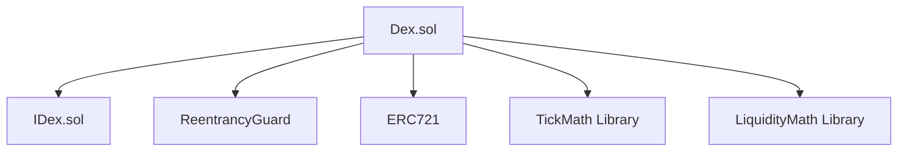

# Decentralized Exchange (DEX)

A concentrated liquidity DEX implementation with NFT positions, inspired by Uniswap v3. This DEX features customizable liquidity ranges, position management through NFTs, and a flexible fee system.

## Features

- 💱 **Concentrated Liquidity Pools**: Provide liquidity in custom price ranges for better capital efficiency
- 🎯 **Custom Price Ranges**: Liquidity providers can choose specific price ranges for their positions
- 🔒 **Position Locking**: Lock positions for specified time periods
- 💰 **Fee Collection**: Earn and collect fees from trading activity
- 🏷️ **NFT Positions**: Positions are represented as NFTs for better transferability and management

## Table of Contents

- [Installation](#installation)
- [Local Development](#local-development)
- [Testing](#testing)
- [Deployment](#deployment)
- [Contract Architecture](#contract-architecture)
- [Security Considerations](#security-considerations)
- [Contributing](#contributing)
- [License](#license)

## Installation

### Prerequisites

- Git
- Foundry
- Node.js (optional, for deployment scripts)

### Setup

1. Install Foundry:
```bash
curl -L https://foundry.paradigm.xyz | bash
foundryup
```

2. Clone the repository:
```bash
git clone https://github.com/yourusername/dex.git
cd dex
```

3. Install dependencies:
```bash
forge install
```

## Local Development

1. Start a local node:
```bash
anvil
```

2. Build the project:
```bash
forge build
```

3. Run tests:
```bash
forge test
```

4. Get test coverage:
```bash
forge coverage
```

## Testing

### Run all tests:
```bash
forge test
```

### Run specific test file:
```bash
forge test --match-path test/unit/DexFees.t.sol
```

### Run with verbosity:
```bash
forge test -vvv
```

### Test Coverage:
```bash
forge coverage --report lcov
genhtml lcov.info -o coverage/
```

## Deployment

### Local Deployment (Anvil)

1. Start local node:
```bash
anvil
```

2. Deploy contracts:
```bash
forge script script/Deploy.s.sol:DeployScript \
    --rpc-url http://localhost:8545 \
    --private-key $PRIVATE_KEY \
    --broadcast
```

### Testnet Deployment (Sepolia)

1. Set up environment variables:
```bash
export SEPOLIA_RPC_URL='your-sepolia-rpc-url'
export PRIVATE_KEY='your-private-key'
export ETHERSCAN_API_KEY='your-etherscan-api-key'
```

2. Deploy to Sepolia:
```bash
forge script script/Deploy.s.sol:DeployScript \
    --rpc-url $SEPOLIA_RPC_URL \
    --private-key $PRIVATE_KEY \
    --broadcast \
    --verify
```

## Contract Architecture

### Core Components



### Core Contracts

1. `Dex.sol`: Main DEX contract
   - Manages pools and positions
   - Handles swaps and liquidity
   - Issues NFT positions
   - Tracks and distributes fees

2. `interfaces/IDex.sol`: Interface definitions
   - Defines all external functions
   - Declares events and errors
   - Specifies data structures

### Libraries

1. `libraries/TickMath.sol`
   - Handles price tick calculations
   - Converts between prices and ticks
   - Manages tick spacing

2. `libraries/LiquidityMath.sol`
   - Calculates liquidity from token amounts
   - Handles liquidity addition/removal
   - Computes fees and rewards

### Key Data Structures

```solidity
struct Pool {
    address token0;
    address token1;
    uint24 fee;
    uint128 liquidity;
    uint160 sqrtPriceX96;
    int24 tick;
    bool initialized;
}

struct Position {
    address owner;
    address token0;
    address token1;
    uint24 fee;
    uint128 liquidity;
    int24 lowerTick;
    int24 upperTick;
    uint256 lockPeriod;
    uint256 lockEndTime;
    uint128 tokensOwed0;
    uint128 tokensOwed1;
}
```

### Core Functions

#### Pool Management
- `createPool()`: Create new trading pair
- `getPool()`: Get pool information

#### Position Management
- `mint()`: Create new position
- `burn()`: Remove position
- `addLiquidity()`: Add to position
- `removeLiquidity()`: Remove from position
- `modifyPosition()`: Change position range
- `lockPosition()`: Lock position

#### Trading
- `swap()`: Execute trade
- `calculateSwapQuote()`: Get price quote

#### Fee Management
- `collectFees()`: Collect earned fees
- `getTokensOwed()`: View uncollected fees

## Deployment Plan

### Phase 1: Local Testing
1. Deploy mock tokens for testing
2. Deploy DEX contract
3. Create initial liquidity pools
4. Test all core functions:
   - Pool creation
   - Position management
   - Swapping
   - Fee collection

### Phase 2: Testnet (Sepolia)
1. Deploy DEX contract
2. Create test pools with test tokens
3. Verify contract on Etherscan
4. Test all functionality in testnet environment
5. Monitor gas usage and optimize if needed

### Phase 3: Security
1. Run static analysis tools
2. Ensure 100% test coverage
3. Document security considerations
4. Perform internal audit
5. Fix any identified issues

## Security Considerations

### Implemented Security Features
- **ReentrancyGuard**: Prevents reentrancy attacks
- **Position Locking**: Prevents unauthorized modifications
- **Access Control**: Owner-based position management
- **Integer Overflow Protection**: Using Solidity 0.8.x built-in checks

### Best Practices
- All external calls come after state changes
- Critical functions are protected against reentrancy
- Events are emitted for important state changes
- Access control is implemented for sensitive functions

## Contributing

1. Fork the repository
2. Create your feature branch (`git checkout -b feature/amazing-feature`)
3. Commit your changes (`git commit -m 'Add some amazing feature'`)
4. Push to the branch (`git push origin feature/amazing-feature`)
5. Create a new Pull Request

### Development Guidelines
- Write tests for all new features
- Maintain test coverage above 90%
- Follow Solidity style guide
- Document all functions and state variables

## License

This project is licensed under the MIT License - see the [LICENSE](LICENSE) file for details.
